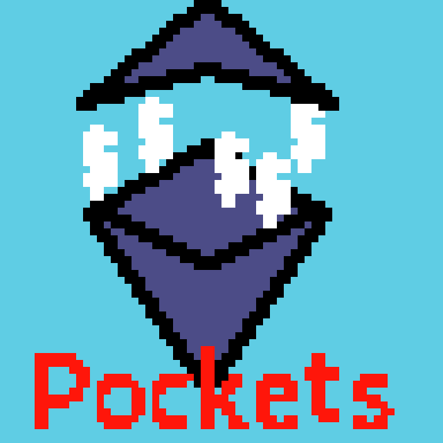
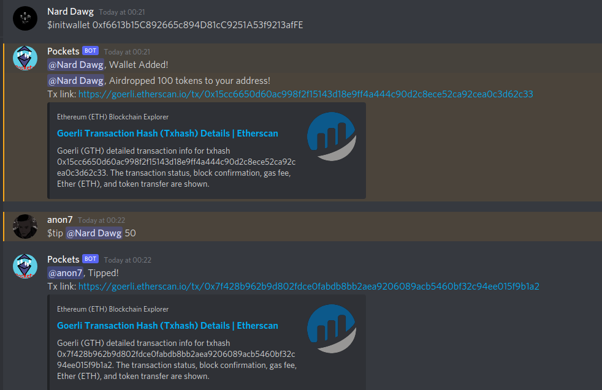

<!-- PROJECT LOGO -->
<br />
<p align="center">
  <a href="https://github.com/merkle-groot/Pockets">
    
  </a>

  <h3 align="center">POCKETS</h3>

  <p align="center">
    A Discord Tipping bot on Ethereum
    <br />
    <br />
    <a href="https://github.com/merkle-groot/Pockets/issues">Report Bug</a>
    ·
    <a href="https://github.com/merkle-groot/Pockets/issues">Request Feature</a>
  </p>
</p>


<!-- TABLE OF CONTENTS -->
<details open="open">
  <summary>Table of Contents</summary>
  <ol>
    <li>
      <a href="#about-the-project">About The Project</a>
      <ul>
        <li><a href="#built-with">Built With</a></li>
      </ul>
    </li>
    <li>
      <a href="#getting-started">Getting Started</a>
      <ul>
        <li><a href="#prerequisites">Prerequisites</a></li>
        <li><a href="#installation">Installation</a></li>
      </ul>
    </li>
    <li><a href="#usage">Usage</a></li>
    <li><a href="#contributing">Contributing</a></li>
    <li><a href="#license">License</a></li>
    <li><a href="#contracts">Contracts</a></li>
    <li><a href="#contracts">Contact Me</a></li>
  </ol>
</details>


<!-- ABOUT THE PROJECT -->
## About The Project



### What is Pockets?
Pockets allows tipping your fellow members on your Discord server with ERC-20 tokens which can be seen as reputation points (i.e like Karma in Reddit). The bot handles all the behind-the-scenes interacting with Pockets smart-contract which keeps track of the token holders. 

### Do the users need actual money to pay for the gas fees?
No, the back-end abstracts out all the UX complexities providing a easy to use bot for anyone in a Discord server. The fees are handled by the bot's wallet which makes transactions on behalf of the users.
It's sort of like meta-transaction other than the fact that users need not sign the transaction.

### Do these tokens have actual value?
Hard no! To avoid the steep learning curve for new users, the bot's handles the transactions, so if actually money is involved the bot's wallet can be misused to mess with user's funds. 

### What problem does it solve?
Pockets can be used to ease-in new users to this brand new technology of blockchains. The users do not have to necessarily depend on the bot, they can also send the tokens among themselves using their own wallets.

### Built With

* [NodeJS](https://nodejs.org/en/)
* [Truffley](https://www.trufflesuite.com/)
* [Web3](https://web3js.readthedocs.io/)
* [ethereumjs-tx](https://github.com/ethereumjs/ethereumjs-tx)
* [Deta](https://docs.deta.sh/docs/)
* [DiscordJS](https://discord.js.org/#/)

<!-- GETTING STARTED -->
## Getting Started

Follow these instructions to get the bot running on your localhost.

### Prerequisites

This is an example of how to list things you need to use the software and how to install them.
* npm
```sh
npm install npm@latest -g
```
* truffle
```sh
npm install truffle -g
```  

### Installation

---
### Installation

#### a) Compiling and Deploying the contracts
</br>


1. Get <a href="https://infura.io/">Infura API </a>for deploying to the testnets

2. Install the required npm packages
```
cd contracts && npm install
```
2. Create a .env file in /contracts folder
```
touch .env
```
3. Put the mnemonic of you wallet and the above mentioned Infura API to the .env file
```
mnemonic='input your mnemonic here'
urlRopsten='https://ropsten.infura.io/v3/yourAPI'
urlKovan='https://kovan.infura.io/v3/yourAPI'
urlRinkeby='https://rinkeby.infura.io/v3/yourAPI'
urlGorli='https://goerli.infura.io/v3/yourAPI'
urlMumbai='https://polygon-mumbai.infura.io/v3/yourAPI'
```
4. Migrate the contracts to testnets, one by one.
```
truffle migrate --network gorli
truffle migrate --network rinkeby
truffle migrate --network ropsten
truffle migrate --network kovan
truffle migrate --network mumbai
```

5. Now the compiled contracts with their abi will be stored in ./server/built_contracts
---
</br> 

#### b) Running the bot server

1. Go to server folder
    ```
    cd server
    ```

2. Input the above mentioned Infura RPC URL, the wallet address, private key of the wallet into config-eg.json.
3. Get a Deta Secret Key from 'https://web.deta.sh/' and input the same to config-eg.json.
4. Go to ./server/built-contracts/Pockets.json and get the address of the contract and ABI and put it in config-eg.json
5. Rename config-eg.josn to config.json
6. Install all the npm modules
    ```
    npm install
    ```
7. If you are using nodemon
    ```
    nodemon index.js
    ```
    else
    ```
    node index.js
    ```
<!-- USAGE EXAMPLES -->
## Usage

1. Initialize Wallet
    ```
    $initwallet 'walletAddress'

    eg:
    $initwallet '0x70D3c39d0Aa755a4613A61B9Fcc7F412F22f41a9'
    ```

2. Check your balance
    ```
    $balance
    ```
3. Tip tokens to your fellow server member
    ```
    $tip 'tag the person' amount

    eg:
    $tip @nardog 30
    ```

## Contracts
[Bitfwd's](https://github.com/bitfwdcommunity/Issue-your-own-ERC20-token) ERC20 contract was used as a base to develop Pockets.

 1. Gorli Network: [0x3D64B6ed42D44Bb0DF2bc2BC85Bce8a26a10d903](https://goerli.etherscan.io/address/0x3D64B6ed42D44Bb0DF2bc2BC85Bce8a26a10d903)

<!-- CONTRIBUTING -->
## Contributing

Contributions are what make the open source community such an amazing place to be learn, inspire, and create. Any contributions you make are **greatly appreciated**.

1. Fork the Project
2. Create your Feature Branch (`git checkout -b feature/AmazingFeature`)
3. Commit your Changes (`git commit -m 'Add some AmazingFeature'`)
4. Push to the Branch (`git push origin feature/AmazingFeature`)
5. Open a Pull Request


<!-- LICENSE -->
## License

Distributed under the MIT License. See `LICENSE` for more information.


<!-- CONTACT -->
## Contact

Vishnu - [@0xpaperhands](https://twitter.com/0xpaperhands) - 0xpaperhands@protonmail.com


